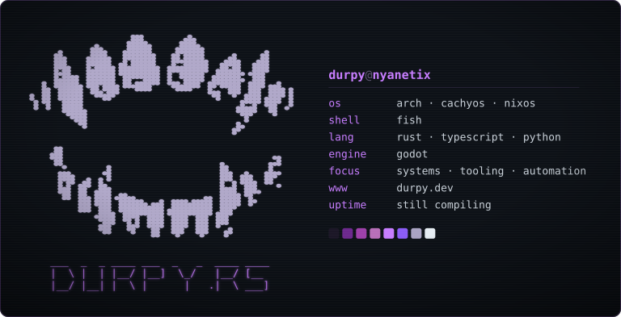
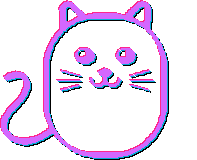

<div align="center">



       

</div>

### ❯ ls -la ~/src


<!-- PROJECTS:START -->
<pre>
┌────────────┬────────────┬──────────────────────────────────────────────┐
│ repo       │ lang       │ description                                  │
├────────────┼────────────┼──────────────────────────────────────────────┤
│ <a href="https://github.com/durpyneko/musubi">musubi</a>     │ rust       │ directed acyclic graph in rust for fun       │
│ <a href="https://github.com/durpyneko/kakure">kakure</a>     │ rust       │ self contained vfs encrypted storage         │
│ <a href="https://github.com/durpyneko/kizuna">kizuna</a>     │ rust       │ breach the gap between connections           │
│ <a href="https://github.com/durpyneko/mimi">mimi</a>       │ rust       │ headphone tray icon (mirror synced)          │
│ <a href="https://github.com/durpyneko/labby">labby</a>      │ typescript │ frontend interview challenge (auto mirrored… │
│ <a href="https://github.com/durpyneko/melancholy">melancholy</a> │ rust       │ low level personal website in rust and weba… │
│ <a href="https://github.com/durpyneko/aishiteru">aishiteru</a>  │ svelte     │ website (this repo is mirrored from my loca… │
│ <a href="https://github.com/durpyneko/rtml">rtml</a>       │ rust       │ rust macro for generating html from a rust-… │
└────────────┴────────────┴──────────────────────────────────────────────┘
</pre>
<!-- PROJECTS:END -->

### ❯ tokei ~/src

<!-- LANGS:START -->
```
typescript  █████████░░░░░░░░░░░░░░░   39.5%
rust        ██████░░░░░░░░░░░░░░░░░░   26.0%
javascript  ██░░░░░░░░░░░░░░░░░░░░░░    9.9%
css         ██░░░░░░░░░░░░░░░░░░░░░░    8.4%
nix         █░░░░░░░░░░░░░░░░░░░░░░░    4.7%
svelte      █░░░░░░░░░░░░░░░░░░░░░░░    4.1%
```
<!-- LANGS:END -->

<br clear="both" />

### ❯ wakatime --today


<!--START_SECTION:waka-->
```
svelte      ███████████████████░░░░░   78.1%  1 hrs 21 mins
css         █████░░░░░░░░░░░░░░░░░░░   20.3%  0 hrs 21 mins
json        ░░░░░░░░░░░░░░░░░░░░░░░░    0.7%  0 hrs 1 mins
html        ░░░░░░░░░░░░░░░░░░░░░░░░    0.4%  0 hrs 0 mins
markdown    ░░░░░░░░░░░░░░░░░░░░░░░░    0.3%  0 hrs 0 mins
typescript  ░░░░░░░░░░░░░░░░░░░░░░░░    0.2%  0 hrs 0 mins

1 hrs 44 mins over last 7 days
```
<!--END_SECTION:waka-->

### ❯ curl -s durpy.dev/info | jq

<pre>
{
  "handle": "durpyneko",
  "www": "<a href="https://durpy.dev">https://durpy.dev</a>",
  "git": "<a href="https://git.durpy.dev">https://git.durpy.dev</a>",
  "x": "<a href="https://x.com/durpyneko">https://x.com/durpyneko</a>",
  "ko-fi": "<a href="https://ko-fi.com/durpyneko">https://ko-fi.com/durpyneko</a>",
  "status": "still compiling"
}
</pre>

<br clear="both" />

### ❯ ./snake

<div align="center">


</div>

<br clear="both" />

---

<div align="center">

[](https://ko-fi.com/durpyneko)



<sub>· · ─ ·ʚɞ· ─ · ·</sub>

</div>
